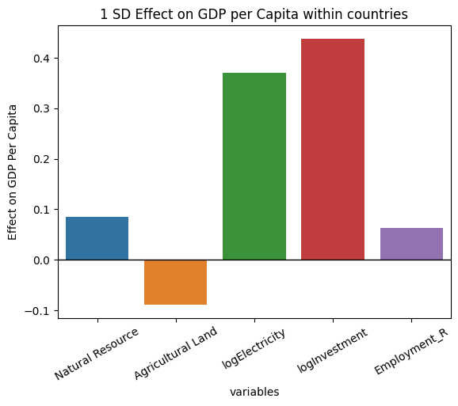
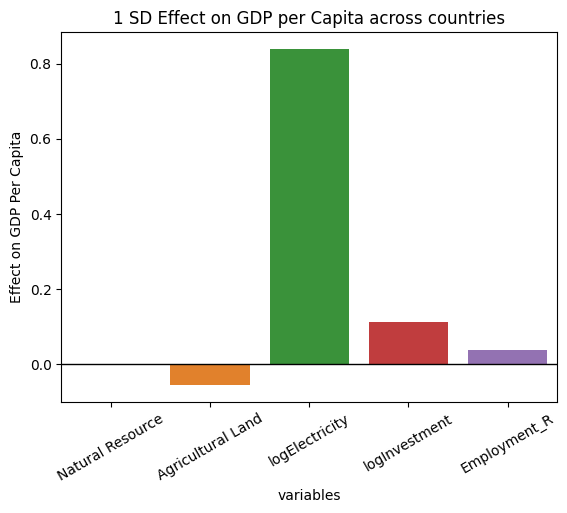

# Geographic Determinants of GDP per Capita

## Overview

This project investigates whether geographic characteristics influence GDP per capita across countries. Using data from the **World Bank** and **CEPII** covering the period **2010–2020**, the analysis explores how agricultural land, natural resource rents, and landlocked status relate to economic performance through panel data econometric techniques.

The project demonstrates the complete data science workflow, from data collection and cleaning to exploratory analysis, statistical modelling, and interpretation of results.

## Results Preview

### Within Effects



### Between Effects



## Objectives

* Collect and integrate international economic and geographic datasets.
* Clean and prepare panel data for analysis.
* Perform exploratory data analysis (EDA).
* Estimate panel regression models to evaluate the relationship between geographic variables and GDP per capita.
* Interpret findings and discuss limitations.

## Dataset

**Sources**

* World Bank Open Data
* CEPIII GeoDist Database

**Time Period**

* 2010–2020

## Tools & Libraries

* Python
* Pandas
* NumPy
* Matplotlib
* Statsmodels
* Linearmodels
* Jupyter Notebook

## Methodology

1. Import and clean raw datasets.
2. Merge economic and geographic indicators.
3. Perform exploratory data analysis and visualisation.
4. Construct panel datasets.
5. Estimate fixed effects regression models.
6. Interpret coefficients, statistical significance, and model performance.

## Repository Structure

```text
├── ForCV.ipynb          # Main analysis notebook
├── data/                # Raw and processed datasets (if included)
├── figures/             # Generated visualisations (optional)
└── README.md
```

## Key Skills Demonstrated

* Data cleaning and preprocessing
* Data wrangling
* Exploratory Data Analysis (EDA)
* Data visualisation
* Panel data econometrics
* Fixed effects regression
* Statistical analysis
* Research communication
* Python programming

## Results

The analysis evaluates the extent to which geographic characteristics are associated with differences in GDP per capita across countries. The notebook presents regression outputs, visualisations, and discussion of the economic interpretation and limitations of the models.

## Author

**Brayant Sagay**

BSc Economics and Data Science student at Royal Holloway, University of London.
